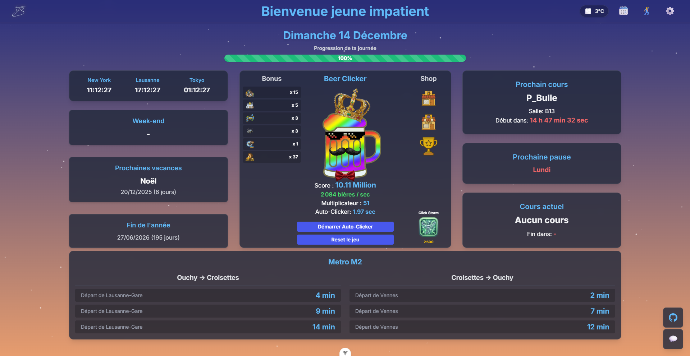

# Horaire & Beer Clicker

**Horaire** est un tableau de bord interactif ultime pour étudiants, combinant utilitaire quotidien et divertissement addictif.

C'est une application riche en fonctionnalités qui fusionne **Agenda Scolaire**, **Suivi des Vacances**, **Informations Locales (Météo/Transport)** et un jeu incrémental : le **Beer Clicker**.



---

## Fonctionnalités Principales

### Tableau de Bord Scolaire

- **Agenda en Temps Réel** : Affiche le cours actuel, le temps restant, et le prochain cours.
- **Gestion des Pauses** : Compte à rebours précis jusqu'à la prochaine pause ou la fin de la journée.
- **Suivi des Vacances** : Décompte automatique jusqu'au week-end et aux prochaines vacances scolaires.
- **Horloges Mondiales** : New York, Lausanne, Tokyo.

### Beer Clicker (Jeu Idle)

Un jeu incrémental complet intégré directement dans le dashboard :

- **Produisez de la Bière** : Cliquez pour brasser, achetez des améliorations (Robots, Usines, Galaxie de Bière).
- **Commerce & Améliorations** : Plus de 20 upgrades uniques avec des effets passifs et actifs.
- **Personnalisation** : Débloquez des **Skins** (Obsidienne, Or, Arc-en-ciel) et équipez des **Accessoires** (Chapeau, Lunettes, etc.).
- **Succès** : Des dizaines de trophées à collectionner.
- **Sauvegarde** : Progression automatique sauvegardée localement.

### Atmosphère & Immersion (Version 2.4+)

- **Météo Dynamique** : Connecté à l'API **MeteoSwiss** (Station Lausanne-Vennes).
  - La pluie, la neige et le brouillard s'affichent visuellement à l'écran.
  - **Optimisation Mobile** : Détection automatique des appareils pour ajuster les effets de particules.
- **Cycle Jour/Nuit** : L'interface change de couleur et d'ambiance selon l'heure (Aube, Jour, Crépuscule, Nuit).
- **Thèmes** : Basculez entre le thème **Sunset Horizon** et **Blue Night**.

### Transport & Utilitaires

- **Widget M2** : Départs en temps réel du Métro M2 (Gare & Vennes).

---

## Stack Technique

Ce projet est construit avec les dernières technologies web modernes pour une performance maximale :

- **Framework** : [Vue 3](https://vuejs.org/) (Composition API)
- **Build Tool** : [Vite](https://vitejs.dev/)
- **Styling** : [Tailwind CSS v4](https://tailwindcss.com/)
- **State Management** : [Pinia](https://pinia.vuejs.org/)
- **Animations** : Web Animations API + Canvas (Particules)
- **API** : OpenMeteo (Weather), Transport API.

---

## Installation & Démarrage

### Prérequis

- Node.js (version 20+)
- npm

### Installation

1. Clonez le projet :

   ```bash
   git clone https://github.com/Fbrend23/Horaire.git
   cd Horaire
   ```

2. Installez les dépendances :

   ```bash
   npm install
   ```

3. Lancez le serveur de développement :
   ```bash
   npm run dev
   ```
   L'application sera accessible sur `http://localhost:5173`.

### Build pour Production

Pour générer les fichiers statiques optimisés :

```bash
npm run build
```

---

## Optimisation Mobile

L'application est entièrement responsive.
Depuis la **v2.4**, un moteur spécifique optimise les effets météo pour les téléphones en réduisant intelligemment le nombre de couches de nuages et de particules pour éviter la surchauffe tout en gardant le style visuel.

---

## Crédits

Développé par **Fbrend23**.

Assisté par **Antigravity** (Google DeepMind) pour migrer le projet sur VueJS.

_© 2024-2025 Horaire - Tous droits réservés._
